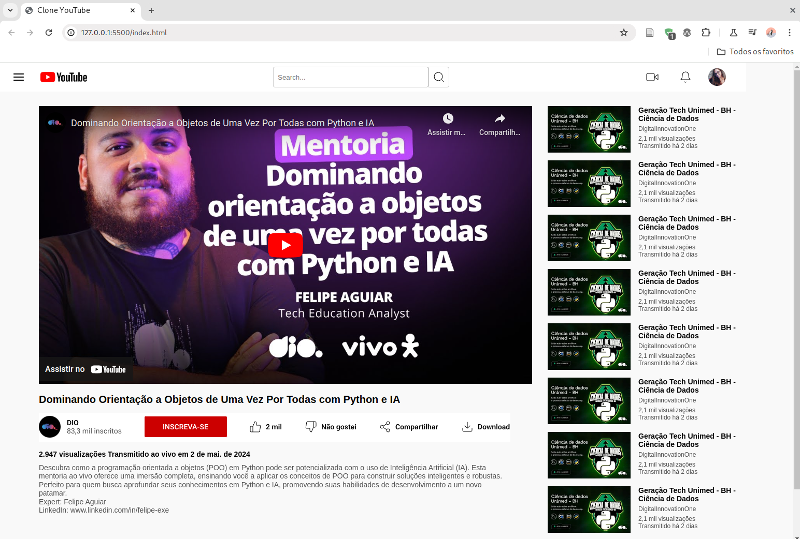

<h1>
    
    Formação CSS Web Developer
</h1>

# :computer: Desafio 02: Clonando a Página do Youtube com CSS

Neste Desafio você colocará a mão na massa e irá clonar a página do YouTube com CSS colocando em prática todos os conceitos aprendidos, principalmente sobre Flexbox.
 
Seja criativo(a) e dê a sua identidade para o Projeto. Lembre-se que para um(a) Profissional de Tecnologia é super importante ter um portfólio sólido e completo.
 
[Link do Figma](https://www.figma.com/file/lrRWUZPKnqMDZrSDJmZxUS/Desafio-de-Flexbox---DIO?node-id=0%3A1) :
Aqui deixamos o link do Design no Figma apresentado pela Expert durante o Desafio para que você o tenha como referência:

# :bulb: Solução do desafio

Implementação nos arquivos <b>index.html</b> e <b>assets/css/style.css</b>

Print screen da página:

